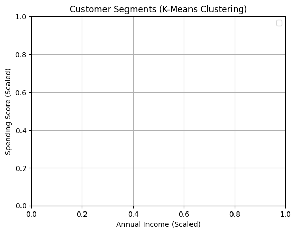

# Customer Segmentation using K-Means Clustering

## Project Overview

This project aims to segment customers of a retail store into distinct groups based on their purchasing behavior. By understanding the different types of customers, the business can develop targeted marketing strategies, improve customer satisfaction, and ultimately drive sales.

We use the **K-Means clustering algorithm**, an unsupervised machine learning technique, to identify these customer segments based on their Annual Income and Spending Score.

---

## Dataset

The analysis is performed on the `Mall_Customers.csv` dataset, which contains the following columns:

* `CustomerID`: A unique identifier for each customer.
* `Genre`: The gender of the customer (Male/Female).
* `Age`: The age of the customer.
* `Annual Income (k$)`: The annual income of the customer in thousands of dollars.
* `Spending Score (1-100)`: A score assigned by the mall based on customer behavior and spending nature (1 being the lowest, 100 being the highest).

---

## Methodology

The project follows a structured data science workflow:

### 1. Data Preprocessing

* **Feature Selection:** For this clustering task, we selected `Annual Income (k$)` and `Spending Score (1-100)` as the primary features to define customer segments.
* **Data Scaling:** As K-Means is a distance-based algorithm, it's crucial that all features are on a similar scale. We used `StandardScaler` from Scikit-learn to standardize the selected features, giving them a mean of 0 and a standard deviation of 1. This prevents the `Annual Income` feature from dominating the `Spending Score`.

### 2. Finding the Optimal Number of Clusters

To determine the ideal number of clusters (`k`), we used the **Elbow Method**:
1.  We ran the K-Means algorithm for a range of `k` values (from 1 to 10).
2.  For each `k`, we calculated the **Within-Cluster Sum of Squares (WCSS)**, which measures the total squared distance between each point and its cluster's center.
3.  We plotted the WCSS against the number of clusters. The "elbow" of the curve—the point where the rate of WCSS decrease slows down significantly—indicates the optimal `k`.

For this dataset, the elbow was clearly visible at **k=5**.

)

### 3. K-Means Clustering

With `k=5` as our optimal number of clusters, we applied the K-Means algorithm to the scaled data. The algorithm grouped the 200 customers into five distinct segments.

---

## Results: The Five Customer Segments

The analysis revealed five customer profiles with distinct characteristics.



### Segment Profiles

| Cluster Name         | Avg. Annual Income (k$) | Avg. Spending Score (1-100) | Avg. Age | Key Characteristics                               |
| -------------------- | ----------------------- | --------------------------- | -------- | ------------------------------------------------- |
| **Target / VIPs** | 86.54                   | 82.13                       | 32.69    | High income, high spending. Most valuable group.  |
| **Frugal Spenders** | 88.20                   | 17.11                       | 41.11    | High income, low spending. Cautious with money.   |
| **Enthusiasts** | 25.73                   | 79.36                       | 25.27    | Low income, high spending. Young and trend-driven.|
| **Standard Customers** | 55.30                   | 49.52                       | 42.72    | Average income, average spending. The core base.  |
| **Budget-Conscious** | 26.30                   | 20.91                       | 45.22    | Low income, low spending. Deal seekers.           |

### Deeper Dive: Gender Distribution

We further analyzed the gender distribution within each segment, revealing that the **Target / VIPs** and **Enthusiasts** groups have a higher proportion of female customers.


---

## Actionable Business Strategies

Based on these segments, the business can implement the following targeted strategies:

1.  **Target / VIPs:**
    * **Strategy:** Nurture and retain.
    * **Actions:** Launch exclusive loyalty programs, offer early access to new collections, and provide personalized shopping experiences.

2.  **Frugal Spenders:**
    * **Strategy:** Highlight value and quality.
    * **Actions:** Target with promotions on high-value items, emphasize product quality and durability over trends, and send notifications for major sales events.

3.  **Enthusiasts:**
    * **Strategy:** Engage with trends and affordability.
    * **Actions:** Use social media marketing to showcase new, trendy items. Offer flexible payment options like "Buy Now, Pay Later."

4.  **Standard & Budget-Conscious Customers:**
    * **Strategy:** Focus on broad appeal and value.
    * **Actions:** Use general marketing campaigns, email newsletters with store-wide promotions, and highlight clearance sales and value-for-money products.

---

## How to Run the Code

1.  **Environment:** This project is designed to run in a Python environment like Google Colab or a local Jupyter Notebook.

2.  **Dependencies:** Ensure you have the following Python libraries installed.
    ```bash
    pip install pandas numpy matplotlib seaborn scikit-learn
    ```

3.  **Dataset:** Place the `Mall_Customers.csv` file in the same directory as your notebook or script.

4.  **Execution:** Run the Python script from top to bottom. The script will automatically perform all steps of the analysis and generate the plots and summary tables.

   ## Developed By

* **Aditya Dasappanavar**
* **GitHub:** [AdityaD28](https://github.com/AdityaD28)
* **LinkedIn:** [adityadasappanavar](https://www.linkedin.com/in/adityadasappanavar/)
